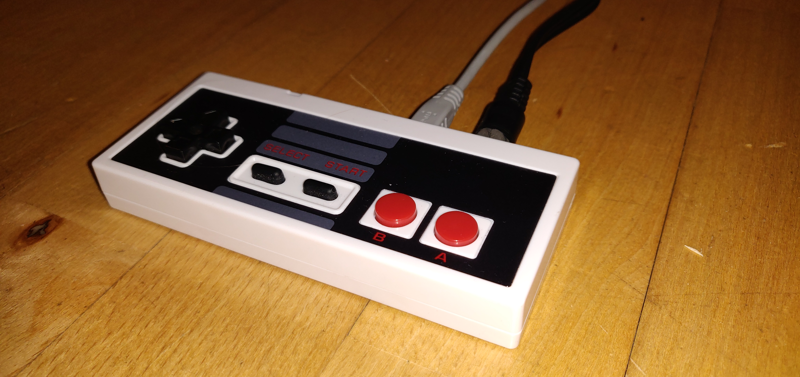
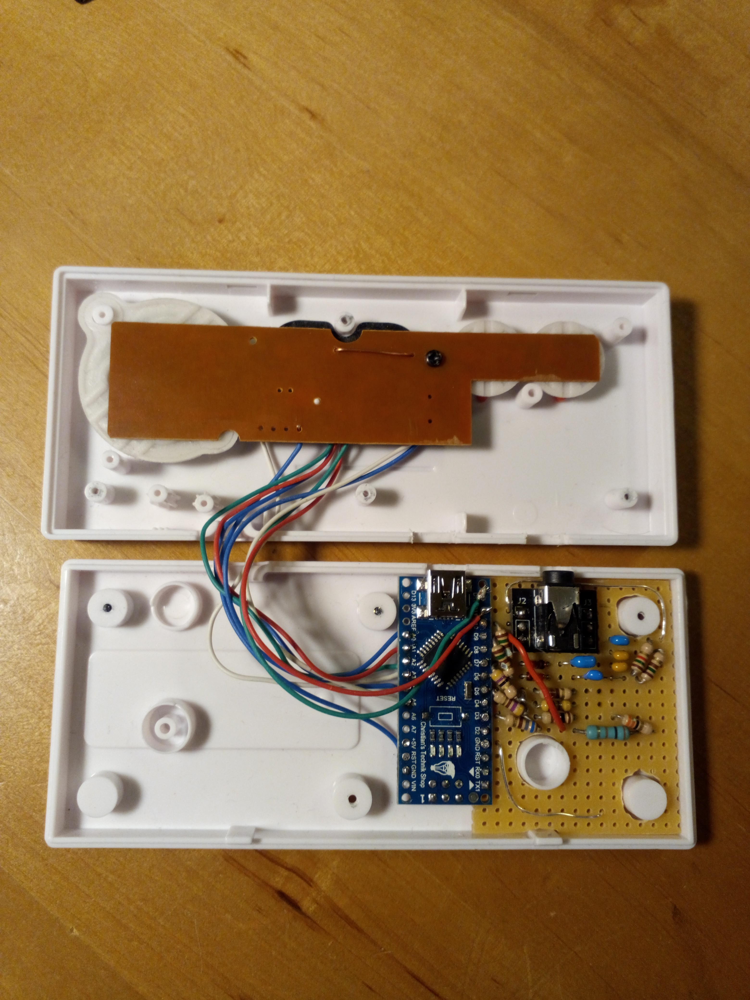
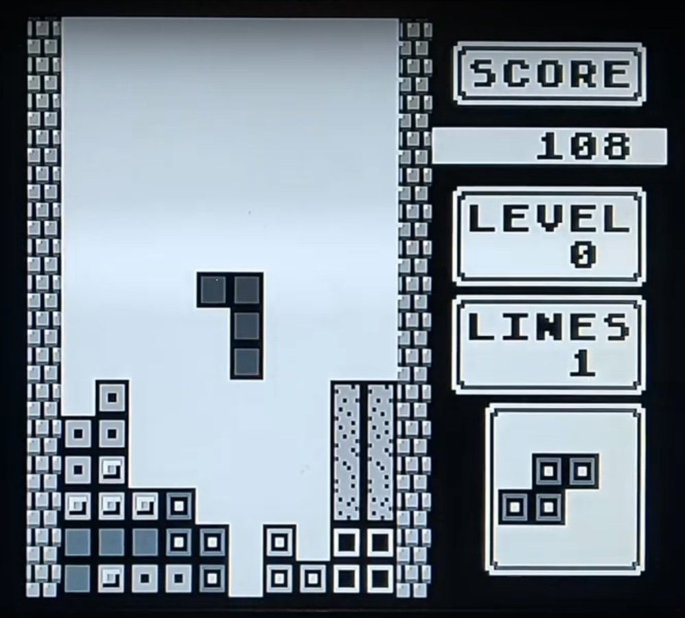

# ArduinoGameConsole
A minimal solution to create audio and video with an Arduino Nano

## Motivation

I wanted to build a game console into the case of a small USB game pad (a NES controler look-alike).
To make the work a challenge, I wanted to only use an Arduino Nano clocked at 16 Mhz and some passive 
components (diodes are OK) and create the best possible video and audio signal that is
imaginable with such restrictions.

As it turned out, a monochrome 288p video signal with 4 gray scales is possible when 
progamming the controller at machine level. 4-channel music is also possible.

My game of choice is Tetris in a version that comes pretty close to the original 
GameBoy version with a very similar audio track.

## How it looks

A short demonstration can be found on https://www.youtube.com/watch?v=HPVpsAUs4aY .
The screen flicker is caused by the phone camera. In reality the picture looks super stable. 

## Implementation details

Generating an analog video signal with an Arduino is quite well known. In this case I use 
two signal pins for the grey levels plus one pin to add the sync signal.

Audio is a bit more tricky. Instead of just using some PWM beeper sounds, I wanted to generate a nicer
custom 8-bit audio waveform with a reasonably high sample rate. As this type of microcontroller
does not have a real DAC, I needed to come up with a custom solution. In this circuit, a capacitor
can be charged or discharged via one of two diodes to reach a specific target voltage for
every sample point of the 15.625 kHz sampled output waveform. I chose this sample fequency because
it is also the line frequency of the video signal, and both signals are generated in close lock-step.
  
The most time critical part of the program is done in AVR assembler code (video generation). 
And I use two of the timers for generating the video sync pulses 
and also the variable-length audio boost pulses with minimal CPU intervention.

